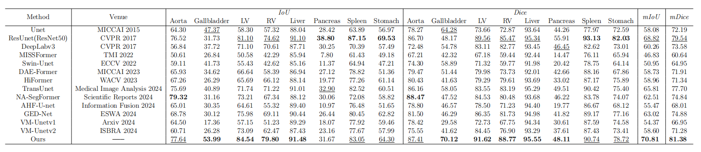

# :tada: Adaptive Frequency-Domain Enhanced Deep Model Driven by Heterogeneous Networks for Medical Image Segmentation
<div align=center>
  <a href="https://github.com/miguelag99/Efficient-Instance-Prediction/blob/main/CHANGELOG.md">
    
  </a>
  
    
  </a>
  <a href="https://pytorch.org">
    
  </a>
  <a href="https://lightning.ai/docs/pytorch/stable/">
    
  </a>
  <a href="https://www.docker.com">
    
  </a>
</div>


***This repository contains the official Pytorch implementation of training & evaluation code for [[AFDSeg](https://github.com/promisedong/AFDSeg)]*** :eye:


## Introduction
### Segmentation performance of various model architectures on the Synapse dataset. Most previous methods rely on a single network architecture and overlook adaptive joint spatiotemporal and frequency-domain feature extraction for the progressive coupling of normal tissues and lesions (organs) in medical images. We revisit the role of the frequency domain in feature extraction and introduce AFDSeg, which outperforms previous state-of-the-art methods in segmentation performance.
<div align="center">
  
</div>
<p align="center">
 Figure 1: Segmentation performance of various model architectures on the Synapse dataset. Most previous methods rely on a single network architecture and overlook adaptive joint spatiotemporal and frequency-domain feature extraction for the progressive coupling of normal tissues and lesions (organs) in medical images. We revisit the role of the frequency domain in feature extraction and introduce AFDSeg, which outperforms previous state-of-the-art methods in segmentation performance.
</p>


<div align="center">
  
</div>
<p align="center">
  Figure 2: (a) Overall architecture of the proposed AFDSeg; (b) The LHSD and FAHS
modules correspond to the denoising branch and the frequency domain branch, respectively, while the PLFA module transforms the frequency domain into the spatial domain,
representing the spatial domain branch. This process involves feature interaction and feature aggregation; (c-d) Prototype-Guided Low-Frequency Feature Aware (PLFA) module
and CBA module; (e) Building Blocks of the Transformer Network.
</p>


## Abstract:
**Accurate medical image segmentation necessitates precise localization of global
structures and local boundaries due to the high variability in lesion shapes
and sizes. However, existing models are limited by conventional spatiotemporal features and single-network architectures, which restrict the simultaneous captures of semantic information and boundary details, thereby
challenging generalizable medical image segmentation. To overcome these
limitations, we propose a heterogeneous network-driven adaptive frequencydomain enhanced deep model(AFDSeg). First, we introduce the Frequency
Domain Adaptive High-Frequency Feature Selection(FAHS) module, which
adaptively extracts high-frequency features to enhance contour and detail
representation while integrating spatiotemporal and frequency-domain features for improved consistency. Additionally, Prototype-Guided Low-Frequency
Feature Aware(PFLA) and Local High-Frequency Salient-Feature Denoising
(LHSD) modules are developed,  which extract discriminative low-frequency features while suppressing local noise in high-frequency components, thereby
facilitating efficient multi-scale feature fusion. Furthermore, the Multi-Level
Prototype Feature Refinement(MPFR) Module is introduced to align low and high-dimensional features during decoding and enhance semantic consistency. Finally, a heterogeneous network framework capable of accommodating multiple network architecture for medical image segmentation is proposed. Our method achieves mDice scores of 93.91%, 88.64%, 90.70%,
91.27%, and 81.38% on the Kvasir-SEG, BUSI, ISIC-2017, ACDC, and Synapse
datasets, respectively, and attains 92.09%, 93.50%, and 83.92% in cross-domain experiments on three unseen datasets (Kvasir Capsule-SEG, BUS42,
and M&Ms). Our approach consistently outperforms state-of-the-art methods on both benchmark and cross-domain datasets. Extensive quantitative and qualitative experiments demonstrated that AFDSeg accurately segments global structures and local details while maintaining superior generalization, underscoring its clinical significance. The Code is available at [AFDSeg](https://github.com/promisedong/AFDSeg).**


## Installation
*We use [Pytorch2.5.1 + CUDA124] as  a software configuration environment.*

### Environment Installation
```
conda create -n AFDSeg python=3.9.13
conda activate AFDSeg
conda install pytorch torchvision torchaudio cudatoolkit -c pytorch

pip config set global.index_url=http://mirrors.aliyun.com/pypi/simple/
pip install numpy==1.24.4
pip install Pillow==9.3.0
tensorboardX==2.6.2.2
```

## Dataset 
- **ACDC:** https://acdc.creatis.insa-lyon.fr/description/databases.html
- **BUSI:** https://scholar.cu.edu.eg/?q=afahmy/pages/dataset
- **Kvasir-SEG:** https://datasets.simula.no/kvasir-seg/
- **ISIC 2017:** https://challenge.isic-archive.com/data/#2017
- **Synapse:** https://www.synapse.org/Synapse:syn3193805/wiki/217789
- **BUI42:** https://github.com/xbhlk/STU-Hospital.git
- **Kvasir Capsule-SEG:** https://datasets.simula.no/kvasir-capsule-seg/
- **M&Ms dataset:** https://www.ub.edu/mnms/


## Results
### Result on the Kvasir-SEG Dataset
* ***Quantitative comparison with state-of-the-art methods on Kvasir-SEG dataset. The optimal results are marked with black bold, and the suboptimal  results are marked with an underline ‘‘–’’. ***
<div align="center">
  
</div>


### Result on the BUSI Dataset
* ***Quantitative comparison with state-of-the-art methods on BUSI dataset. The optimal results are marked with black bold, and the suboptimal  results are marked with an underline ‘‘–’’. ***
<div align="center">
  
</div>


* ***Visual comparison of segmentation results for binary segmentation on BUSI and  Kvasir-SEG datasets ***
<div align="center">
  
</div>


### Result on the ACDC and Synapse Dataset
* ***Quantitative comparison with state-of-the-art methods on ACDC dataset. The optimal results are marked with black bold, and the suboptimal  results are marked with an underline ‘‘–’’.***
<div align="center">
  
</div>

* ***Quantitative comparison with state-of-the-art methods on Synapse dataset. The optimal results are marked with black bold, and the suboptimal  results are marked with an underline ‘‘–’’.***
<div align="center">
  
</div>

* **Visual comparison between AFDSeg and state-of-the-art methods for multi-class segmentation tasks on ACDC [36] and Synapse datasets[39] (Left: Cardiac Segmentation; Right: Abdominal multi-organ Segmentation)**
<div align="center">
  
</div>


### Visualization of the quantitative comparison results between AFDSeg and state-of-the-art methods across five datasets
<div align="center">
  
</div>
<p>
Visualization of the quantitative comparison results between AFDSeg and state-of-the-art methods across five datasets
</p>

**-----------------------------------------------------------------------------------------------------------------------------------------------------------**

## Cross-domain segmentation for generalization performance analysis

### Kvasir-SEG → Kvasir Capsule-SEG
* **Cross-domain quantitative analysis (training on Kvasir-SEG Dataset, model generalizability testing on Kvasir Capsule-SEG dataset[45]). The optimal results are marked with black bold, and the suboptimal  results are marked with an underline ‘‘–’’.**
<div align="center">
  
</div>


* **Visual comparison between AFDSeg and state-of-the-art methods for cross-domain segmentation Kvasir-SEG → Kvasir Capsule-SEG**
<div align="center">
  
</div>


### BUSI → BUS42
* **Cross-domain quantitative analysis (training on BUSI Dataset, model generalizability testing on BUS42 dataset [46]). The optimal results are marked with black bold, and the suboptimal  results are marked with an underline ‘‘–’’.**
<div align="center">
  
</div>


* **Cross-domain quantitative analysis (training on Kvasir-SEG Dataset, model generalizability testing on Kvasir Capsule-SEG dataset[45]). The optimal results are marked with black bold, and the suboptimal  results are marked with an underline ‘‘–’’.**
<div align="center">
  
</div>


### ACDC → M&Ms
* **Cross-domain quantitative analysis (training on ACDC dataset, model generalizability testing on M&MS dataset). The optimal results are marked with black bold, and the suboptimal results are marked with an underline “–”.**
<div align="center">
  
</div>

* **Cross-domain quantitative analysis (training on ACDC dataset, model generalizability testing on M&MS dataset). The optimal results are marked with black bold, and the suboptimal results are marked with an underline “–”.**
<div align="center">
  
</div>
**--------------------------------------------------------------------------------------------------------------------------------------------------------**

## Ablation Study
### Ablation study for proposed modules
* ***The ablation study of each module on the ACDC dataset. The optimal results are marked with black bold, and the suboptimal  results are marked with an underline ‘‘–’’. ***
<div align="center">
  
</div>

* **TVisual comparison between AFDSeg and state-of-the-art methods for cross-domain segmentation ACDC → M&Ms. Left: Entropy map [44] shows a better certainty
for the predictions of our AFDseg. Right: T-SNE [45] shows a better category separability
for our AFDseg**
<div align="center">
  
</div>


### Ablation study for heterogeneous networks
* ***The ablation study of heterogeneous network on the ACDC dataset. The
optimal results are marked with black bold, and the suboptimal results are marked with
an underline “–”.***
<div align="center">
  
</div>


* ***Visualize the recognition accuracy of different heterogeneous networks on medical image features (red circles indicate regions with stronger feature coupling, where other
models fail to perform fine-grained segmentation)***
<div align="center">
  
</div>


### Ablation study for feature distillation alignment loss
* ***The ablation study of feature distillation alignment loss on the ACDC dataset.
The optimal results are marked with black bold.***
<div align="center">
  
</div>


* ***Visualize the recognition accuracy of distillation alignment loss on medical
image features (red rectangles indicate regions with stronger feature coupling, where other
models fail to perform fine-grained segmentation)***
<div align="center">
  
</div>


### Ablation study for filter window size of the FASM module
* ***The ablation study for the size of the filtering window of FASM module on the
ACDC dataset. The optimal results are marked with black bold. (Size: Filter Window
Size)***
<div align="center">
  
</div>


* ***Visualize the feature response after FAHS using Grad-CAM***
<div align="center">
  
</div>

**--------------------------------------------------------------------------------------------------------------------------**

## Visualize the bubble plots of FLOPs and mDice composite metrics for each dataset
<div align="center">
  
</div>
<p>
Visualize the bubble plots of FLOPs and mDice composite metrics for each dataset
</p>


## Test
* **Check out eval.sh for test file configuration**
  * ***Mask visualization***
  * ***T-SNE visualization***
  * ***Grad-CAM visualization***
  * ***Entropy Map visualization***

## License
 The code is released under the MIT license[](https://opensource.org/licenses/MIT).


## Relevant Projects
***[1] Semantic distribution-aware contrastive adaptation for semantic segmentation  - IEEE TRANSACTIONS ON PATTERN ANALYSIS AND MACHINE INTELLIGENCE*** [**[arXiv](https://arxiv.org/abs/2105.05013) [code](https://github.com/BIT-DA/SDCA)**]
***[2] (Project)[https://github.com/gasking]***

- ***Thanks for their nice contribution.***
